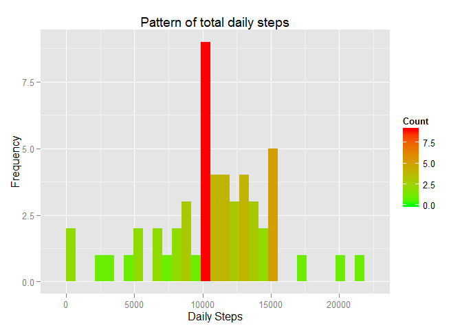

# Reproducible Research: Peer Assessment 1
## Introduction

>It is now possible to collect a large amount of data about personal movement using activity monitoring devices such as a Fitbit, Nike Fuelband, or Jawbone Up. These type of devices are part of the "quantified self" movement - a group of enthusiasts who take measurements about themselves regularly to improve their health, to find patterns in their behavior, or because they are tech geeks.  
>This assignment makes use of data from a personal activity monitoring device. This device collects data at 5 minute intervals through out the day. The data consists of two months of data from an anonymous individual collected during the months of October and November, 2012 and include the number of steps taken in 5 minute intervals each day.

## Loading and preprocessing the data
    
>This segment is for loading the data from the activity.zip file and processing it into a analytic data.Please follow comments in the code for better understanding.


```r
# unzip the file
unzip("activity.zip")
# Get Data from csv file
amd <- read.csv("activity.csv" , header = TRUE)
 
# Change date class from factor of strings to DATE class:This helps us manupulate date field  
levels(amd$date) <- as.Date(levels(amd$date))
amd$date <- as.Date(amd$date)

# Sample the data 
nall<- nrow(amd)
head(amd)
```

```
##   steps       date interval
## 1    NA 2012-10-01        0
## 2    NA 2012-10-01        5
## 3    NA 2012-10-01       10
## 4    NA 2012-10-01       15
## 5    NA 2012-10-01       20
## 6    NA 2012-10-01       25
```

```r
#Remove NA values in amd2 and sample the data

amd2 <- amd[!(is.na(amd$steps)|is.na(amd$date)|is.na(amd$interval)),]
nnona <-  nrow(amd2)
head(amd2)
```

```
##     steps       date interval
## 289     0 2012-10-02        0
## 290     0 2012-10-02        5
## 291     0 2012-10-02       10
## 292     0 2012-10-02       15
## 293     0 2012-10-02       20
## 294     0 2012-10-02       25
```
>The number total number of records is 17568 and total number of non NA records is 15264.

## What is mean total number of steps taken per day?
>In this part of the analysis we see pattern of daily activity


```r
# summarize and plot
library("plyr")
library("ggplot2")

summ <- ddply(amd2, .(date),summarize,steps = sum(steps))
qplot(steps,data = summ,geom = "histogram",xlab = "Daily Steps", ylab = "Frequency",
      main = "Pattern of total daily steps" , ylims = 10 )+
    geom_histogram(aes(fill = ..count..)) + 
    scale_fill_gradient("Count", low = "green", high = "red")
```

 

```r
# Find mean and median daily steps
meansteps <- as.character(round(mean(summ$steps),2))
mediansteps <- as.character(round(median(summ$steps),2))
```
>The mean of total number of steps 10766.19 and meadian is 10765

## What is the average daily activity pattern?
>In this part we analyse how activity is distributed in an average day.


```r
# summarize and plot
library("plyr")
library("ggplot2")
summ <- ddply(amd2, .(interval),summarize,steps = mean(steps))


qplot(interval,steps,data = summ, geom = c("point","path"),
      xlab = "Daily Time Interval",ylab ="Average steps", 
      main= "Average Daily Activity Pattern")+
    geom_line(color = "red", size = 2) +geom_point(color = "green")
```

 

```r
chk <- summ$steps == max(summ$steps)
x <- summ[chk,1]
```
>Maximum activity happens during 835 minutes.

## Imputing missing values
>In this part we find the missing values and impute them to be the average values in the time interval. Further we check the daily activity pattern. 

```r
nastep <-  sum(is.na(amd$steps))
nadate <- sum(is.na(amd$date))
naint <- sum(is.na(amd$interval))

print("Impute principle for steps : Average daily interval activity" )
```

```
## [1] "Impute principle for steps : Average daily interval activity"
```

```r
library("plyr")
lookup<- ddply(amd2, .(interval),summarize,steps = mean(steps))
newamd <- amd
for (i in 1:nrow(newamd))
    if (is.na(newamd[i,1]))
        newamd[i,1] = lookup[lookup$interval == newamd[i,3],2]
# histogram for number of steps

library("ggplot2")
summ <- ddply(newamd, .(date),summarize,steps = sum(steps))
 qplot(steps, data=summ , geom = "histogram", xlab = "Daily Steps" , 
         ylab = "Frequency" ,main = "Imputed Data :Total Daily Steps")+
      geom_histogram(aes(fill = ..count..)) + 
      scale_fill_gradient("Count", low = "green", high = "red")
```

 

```r
newmeansteps <- as.character(round(mean(summ$steps),2))
newmediansteps <- as.character(round(median(summ$steps),2))
```
>Number of NA in steps = 2304, in date = 0 and in intervals = 0.  
>The mean of total number of steps 10766.19 and meadian is 10766.19

## Are there differences in activity patterns between weekdays and weekends?
>In this section we see if there is difference in activity pattern in weekdays and weekends.

```r
library("plyr")
#add a column to find the day of the week
newamd$days <- weekdays(newamd$date)

# classify the days of the week as weekday and weekends
x <- data.frame( days = c("Sunday", "Monday","Tuesday", "Wednesday", "Thursday", "Friday" ,"Saturday"),
define = c("weekend", "weekday", "weekday", "weekday", "weekday", "weekday","weekend" ) )
newamd <- merge(newamd,x)

#summarise and plot
summ <- ddply(newamd, .(interval,define), summarize , steps = mean(steps))


library(lattice)
xyplot(steps ~ interval | define ,data= summ ,layout = c(1,2), type = c("p","l"),pch= 16 ,col = "green") 
```

 
